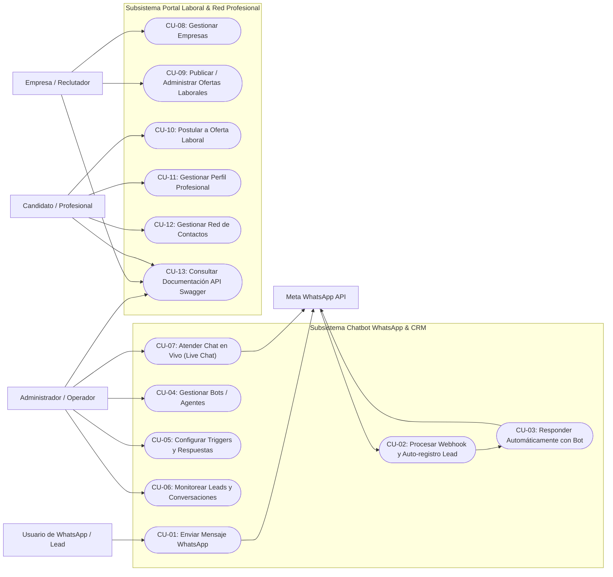
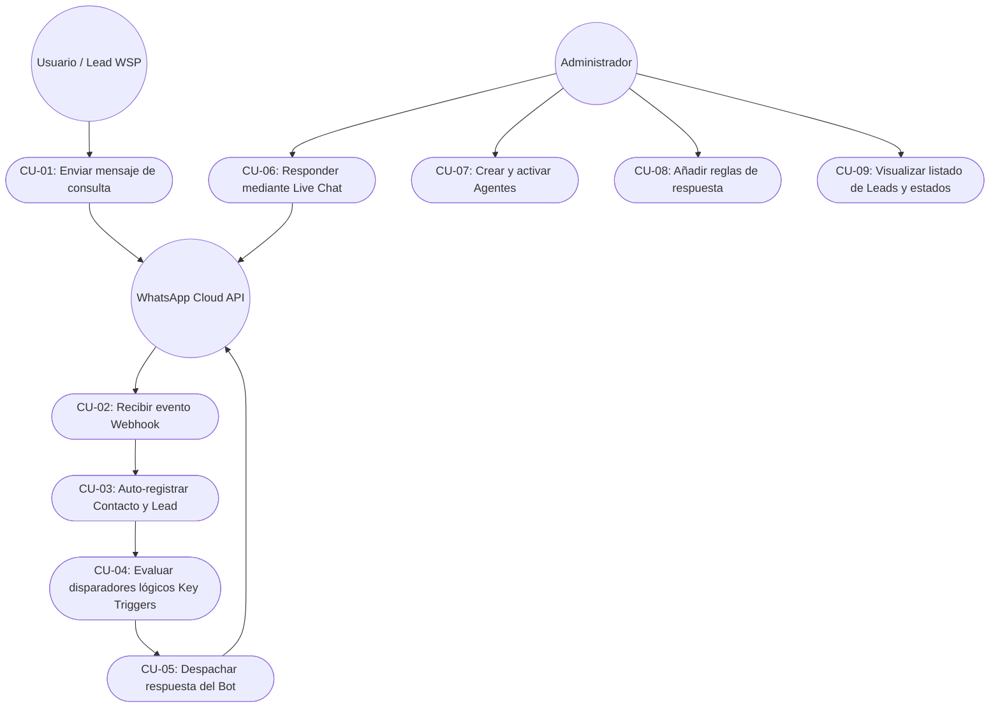
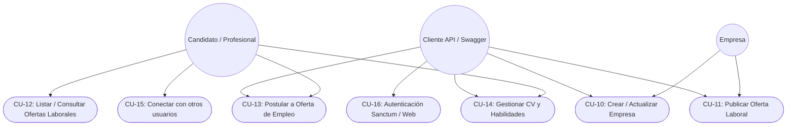

# Documento de Diagramas de Casos de Uso y Funcionalidades
## Proyecto: Circle of Links - Chatbot WSP & Portal Laboral

---

## 1. Identificación de Actores del Sistema

| Actor | Tipo | Descripción |
| :--- | :--- | :--- |
| **Usuario de WhatsApp / Lead** | Humano / Externo | Persona que envía mensajes al número de WhatsApp de la plataforma para solicitar información o interactuar con el bot. |
| **Administrador / Operador de Soporte** | Humano / Interno | Administrador autenticado en el panel web (`/admindashboard`). Gestiona bots, triggers, prospectos y atiende en tiempo real vía *Live Chat*. |
| **Candidato / Profesional** | Humano / Externo | Usuario de la aplicación que administra su perfil profesional, consulta ofertas de empleo y realiza postulaciones. |
| **Empresa / Reclutador** | Humano / Externo | Entidad u organización que publica ofertas laborales y gestiona los requerimientos de talento. |
| **Meta WhatsApp Cloud API** | Sistema Externo | API de Meta que despacha eventos vía Webhook hacia Laravel y procesa solicitudes de envío de mensajes hacia los clientes. |

---

## 2. Diagramas de Casos de Uso (Mermaid)

### 2.1. Diagrama General del Sistema

---

### 2.2. Diagrama de Casos de Uso: Módulo Chatbot & CRM WhatsApp

---

### 2.3. Diagrama de Casos de Uso: Módulo Portal Laboral & Red Profesional

---

## 3. Especificación Detallada de Casos de Uso

### CU-01: Enviar Mensaje por WhatsApp
* **Actor Principal**: Usuario de WhatsApp / Lead.
* **Precondiciones**: El usuario cuenta con la app de WhatsApp y el número telefónico del servicio.
* **Flujo Principal**:
  1. El usuario envía un mensaje de texto al número de la aplicación.
  2. Meta procesa el mensaje y genera un webhook hacia el servidor Laravel.
* **Postcondiciones**: El mensaje ingresa al flujo de recepción del sistema.

---

### CU-02: Procesar Webhook y Auto-registro de Contacto/Lead
* **Actor Principal**: Meta WhatsApp Cloud API (Sistema Externo).
* **Controlador**: `WspbController@recibir` -> `ConversationWsp`.
* **Flujo Principal**:
  1. El webhook recibe el payload JSON en `POST /wspservice`.
  2. `UserWsp` parsea el número telefónico del remitente y el contenido del texto.
  3. `ConversationWsp` consulta si el número existe en `UserAppContact`.
  4. Si no existe, crea automáticamente un registro `UserApp` con estado "no registrado" y un `UserAppContact`.
  5. Se registra/actualiza el registro en la tabla `leads` con el timestamp actual.
* **Postcondiciones**: El contacto queda almacenado y listo para ser gestionado en el CRM.

---

### CU-03: Evaluar Trigger y Enviar Respuesta Automatizada
* **Actor Principal**: Motor del Bot (`BotWsp.php`).
* **Flujo Principal**:
  1. `BotWsp` consulta todos los agentes con estado `active` (`Agent::where('status', 'active')`).
  2. Itera sobre las respuestas lógicas (`logicResponses`) asociadas a cada bot.
  3. Ejecuta una comparación por expresiones regulares (`logicResponseToMessage`) entre el mensaje del usuario y el campo `key_trigger`.
  4. Al encontrar una coincidencia, selecciona el texto de respuesta configurado.
  5. `WspSendMessageController@sendMessageWsp` ejecuta una llamada cURL `POST` a la Graph API de Meta (`https://graph.facebook.com/v19.0/{PHONE_ID}/messages`).
  6. WhatsApp entrega el mensaje de respuesta al usuario final.
* **Flujo Alternativo**: Si ninguna palabra clave coincide, el mensaje queda guardado en la conversación para atención por un operador humano.

---

### CU-04: Atender Chat en Vivo (Live Chat Humano)
* **Actor Principal**: Administrador / Operador de Soporte.
* **Vistas & Controladores**: `resources/views/whatsapp_service/leads/index.blade.php`, `ChatLeadController`.
* **Flujo Principal**:
  1. El administrador ingresa a `/admindashboard/leads`.
  2. Hace clic en el botón **"chat Live"** de un prospecto específico.
  3. Mediante una petición AJAX (`hellojsonGet`), se carga el componente `/component/chatlead/{id_lead}` dentro de un modal interactivo.
  4. El operador visualiza el historial completo de mensajes organizados cronológicamente.
  5. El operador escribe una respuesta en el formulario y hace clic en **"enviar"**.
  6. Se dispara `POST /sendmessagewsp` con el mensaje y el número destino.
  7. El mensaje es enviado al WhatsApp del cliente mediante la Cloud API.
* **Postcondiciones**: El usuario recibe la atención personalizada en su WhatsApp.

---

### CU-05: Gestión de Bots / Agentes Virtuales
* **Actor Principal**: Administrador.
* **Controlador**: `AgentController`.
* **Flujo Principal**:
  1. El administrador accede a `/admindashboard/bots-r`.
  2. Puede dar de alta un nuevo agente en `/admindashboard/bots-r-fabric` indicando nombre, descripción y versión.
  3. Puede cambiar el estado del agente a `active` o `inactive` desde `/admindashboard/bots-r-actives`.
* **Postcondiciones**: Los bots activos quedan habilitados para responder de manera automática.

---

### CU-06: Configuración de Respuestas Lógicas (Logic Responses)
* **Actor Principal**: Administrador.
* **Controlador**: `LogicResponseController`.
* **Flujo Principal**:
  1. El administrador selecciona un agente existente y accede a `/admindashboard/bots-r/{idagent}/logicresponse-create`.
  2. Ingresa el nombre de la regla, la palabra clave o disparador (`key_trigger`) y el texto de respuesta (`response`).
  3. Envía el formulario (`POST /admindashboard/logicresponse`).
* **Postcondiciones**: La regla se asocia al agente y se evalúa en futuras interacciones de WhatsApp.

---

### CU-07: Gestión de Empresas (CRUD)
* **Actor**: Administrador / Empresa vía API REST.
* **Controlador**: `EmpresaController` (`/api/v1/empresa`).
* **Operaciones**:
  * **Crear Empresa**: Registra nombre, correo electrónico único, avatar, dirección física y rubro industrial.
  * **Listar / Consultar**: Obtiene el catálogo de empresas o el detalle de una empresa por ID.
  * **Actualizar**: Modifica campos de la empresa mediante método `PATCH`.
  * **Eliminar**: Borra el registro de la empresa si no posee ofertas activas vinculadas.

---

### CU-08: Publicación y Administración de Ofertas Laborales
* **Actor**: Empresa / Administrador.
* **Controlador**: `OfertaLaboralController` (`/api/v1/ofertalaboral`).
* **Operaciones**:
  * **Publicar Oferta**: Registra título, nombre, descripción del puesto, fecha de expiración, salario, empresa emisora y estado.
  * **Consultar Ofertas**: Listado público en JSON de ofertas disponibles.
  * **Actualizar Oferta**: Modificación de condiciones salariales o descripción.
  * **Eliminar / Cerrar Oferta**: Baja lógica o física del requerimiento.

---

### CU-09: Postulación a Ofertas Laborales
* **Actor**: Candidato / Profesional.
* **Controlador**: `PostulacionOfertaLaboralController` (`/api/v1/postulacionofertalaboral`).
* **Flujo**:
  1. El usuario selecciona una oferta laboral existente (`oferta_laboral_id`).
  2. Registra su postulación indicando nombre, mensaje de presentación y fecha límite.
* **Postcondiciones**: La postulación queda registrada vinculada a la oferta laboral.

---

### CU-10: Gestión de Perfil Profesional Curricular
* **Actor**: Candidato / Usuario Profesional.
* **Controlador**: `User_perfilController` (`/api/v1/usersperfil`).
* **Flujo**:
  1. El usuario crea o actualiza su perfil profesional.
  2. Se registran datos de formación académica (`education`), experiencia laboral previa (`exp_laboral`), habilidades técnicas (`habilidades`) y profesión (`profetion_name`).
* **Postcondiciones**: El perfil queda asociado a la cuenta de usuario para procesos de selección.

---

### CU-11: Gestión de Red de Contactos
* **Actor**: Usuario Profesional.
* **Controlador**: `UserContactController` (`/api/v1/usercontact`).
* **Flujo**:
  1. Permite establecer conexiones entre usuarios (`user_id` y `contact_id`).
  2. Registro del estado del vínculo (pendiente, aceptado, etc.).

---

### CU-12: Exploración y Pruebas con Swagger UI
* **Actor**: Desarrollador / Integrador / Administrador.
* **Ruta**: `/api/documentation`.
* **Flujo**:
  1. El usuario accede a la interfaz interactiva Swagger.
  2. Visualiza esquemas de datos, parámetros requeridos, respuestas JSON de ejemplo y códigos de estado HTTP.
  3. Puede ejecutar peticiones de prueba directamente desde el navegador.

---

## 4. Matriz de Trazabilidad: Funcionalidades vs Casos de Uso

| Funcionalidad del Sistema | Casos de Uso Relacionados | Controladores Involucrados |
| :--- | :--- | :--- |
| **Recepción & Webhook WhatsApp** | CU-01, CU-02 | `WspbController`, `ConversationWsp`, `UserWsp` |
| **Motor de Respuestas Automáticas** | CU-03 | `BotWsp`, `WspSendMessageController`, `Agent`, `LogicResponse` |
| **Chat en Vivo (Live Chat)** | CU-04 | `ChatLeadController`, `WspSendMessageController` |
| **Administración de Bots y Triggers** | CU-05, CU-06 | `AgentController`, `LogicResponseController` |
| **CRM de Leads y Contactos** | CU-02, CU-04 | `LeadController`, `Web\UserAppController`, `Web\UserAppContactController` |
| **Directorio de Empresas** | CU-07 | `EmpresaController` |
| **Bolsa de Ofertas de Empleo** | CU-08 | `OfertaLaboralController`, `StatusOfertaLaboralController` |
| **Módulo de Postulaciones** | CU-09 | `PostulacionOfertaLaboralController` |
| **Perfiles Curriculares** | CU-10 | `User_perfilController` |
| **Red de Contactos Profesionales** | CU-11 | `UserContactController` |
| **Documentación OpenAPI / Swagger** | CU-12 | L5-Swagger Generator |
