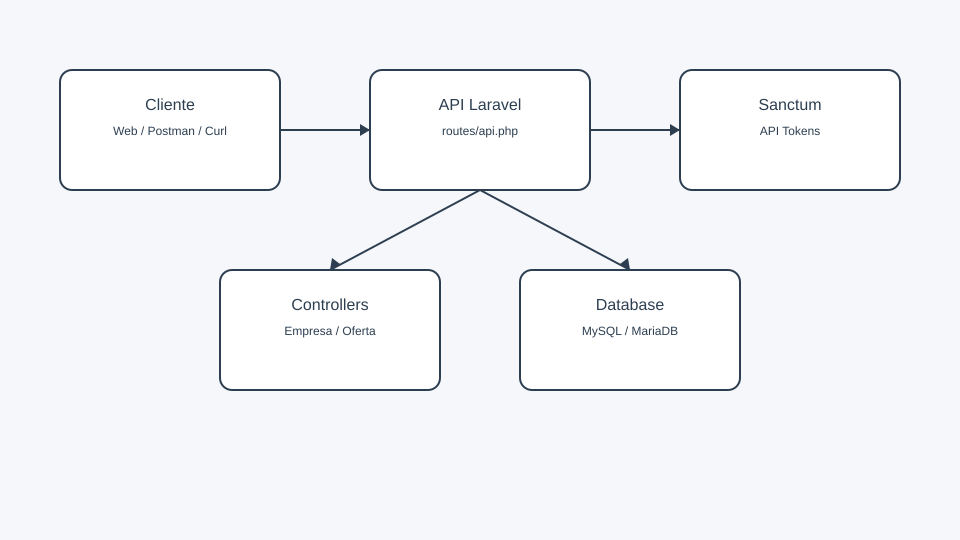
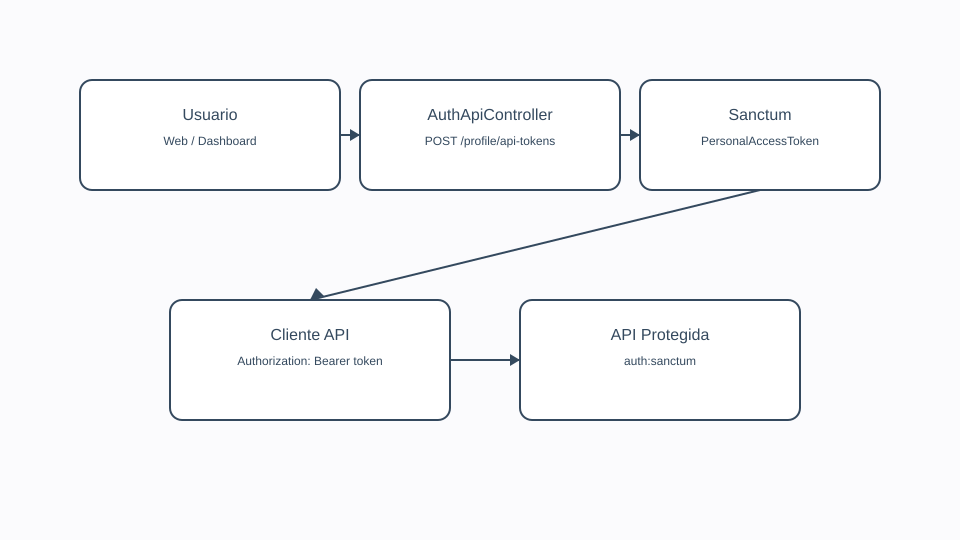

# Documentacion del Proyecto y API

Este documento describe el funcionamiento general del proyecto, la arquitectura de la API y ejemplos para pruebas.

## Resumen del proyecto

- Backend: Laravel (API en `routes/api.php`, web en `routes/web.php`).
- Autenticacion API: Sanctum con API keys (Personal Access Tokens).
- Frontend: Vite + JS/TS. El cliente consume la API con `resources/js/core/ApiService.ts`.
- Prefijo API: `api/v1` (ver `app/Providers/RouteServiceProvider.php`).

## Arquitectura de la API

## Configuracion basica (local)

1. Instalar dependencias backend:
   - `composer install`
2. Configurar variables de entorno:
   - Copiar `.env.example` a `.env`
   - Ajustar `APP_URL`, `DB_*`
3. Generar key y migrar:
   - `php artisan key:generate`
   - `php artisan migrate`
4. Frontend:
   - `npm install`
   - `npm run dev`

## Autenticacion con API Key (Sanctum)

- Crear un token desde la interfaz web:
  - Iniciar sesion y visitar `GET /profile/api-tokens`.
  - Crear un token y guardar el `plain_text_token`.
- Usar el token en la API:
  - Header: `Authorization: Bearer {token}`

## Endpoints principales (API v1)

Base URL: `http://{host}/api/v1`

Ejemplos:

- `GET /empresa`
- `POST /empresa` (requiere `Authorization: Bearer {token}`)
- `GET /ofertalaboral`
- `GET /empresa/{id}/ofertalaboral`

Para el listado completo y ejemplos detallados ver `DOCUMENTACION_API.md`.

## Swagger / OpenAPI

La documentacion OpenAPI se encuentra en los controladores, por ejemplo:
- `app/Http/Controllers/EmpresaController.php`
- `app/Http/Controllers/OfertaLaboralController.php`

Si estas usando un generador (por ejemplo l5-swagger), ejecuta el comando correspondiente para refrescar el esquema.

## Notas para pruebas

- Las rutas API usan el prefijo `api/v1`.
- Para endpoints protegidos, recuerda enviar `Authorization: Bearer {token}`.
- Si usas Postman/Insomnia, guarda el token en un environment.
