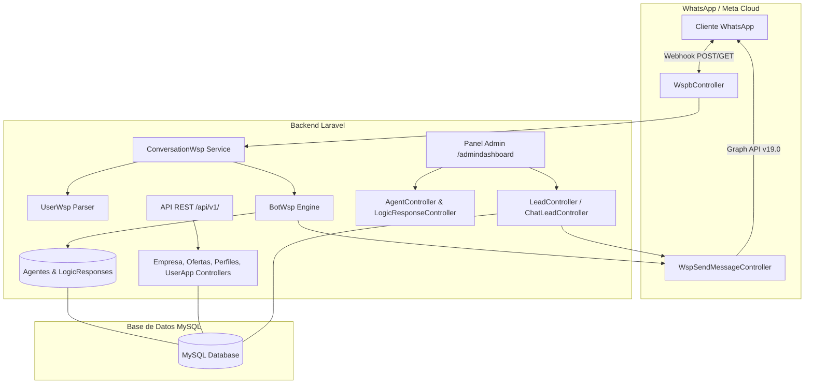
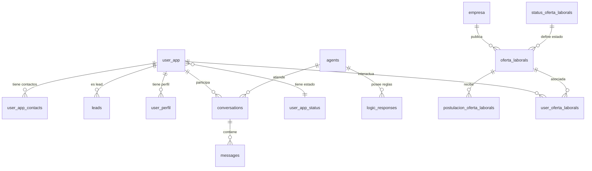

# Documentación Técnica del Proyecto: Circle of Links - Chatbot WhatsApp & Portal Laboral

## 1. Resumen Ejecutivo del Proyecto

El proyecto **Circle of Links - Chatbot WSP** es una aplicación web desarrollada sobre el framework **Laravel 9**, diseñada con una doble arquitectura de servicios:

1. **CRM y Chatbot Automatizado de WhatsApp**: Un sistema integral de recepción, clasificación y respuesta de mensajes a través de la **WhatsApp Cloud API (Meta Graph API v19.0)**. Incorpora un motor de bots/agentes virtuales configurables con disparadores lógicos (*key triggers*), gestión y captura automática de prospectos (*Leads*), persistencia del historial de conversaciones y una interfaz de **Chat en Vivo (*Live Chat*)** para atención humana directa en tiempo real.
2. **Portal Laboral y Red Profesional (Circle of Links)**: Un subsistema de gestión de talento, ofertas de empleo, empresas contratantes, perfiles curriculares, postulaciones y redes de contacto, expuesto a través de una **API RESTful** documentada bajo el estándar **OpenAPI / Swagger (L5-Swagger)** y protegido por tokens mediante **Laravel Sanctum**.

---

## 2. Stack Tecnológico

| Capa | Tecnologías |
| :--- | :--- |
| **Backend Framework** | Laravel 9.x (PHP ^8.0) |
| **Autenticación & Seguridad** | Laravel Breeze (Sesiones web), Laravel Sanctum (Tokens API) |
| **Documentación de API** | L5-Swagger 8.6 (OpenAPI / Swagger UI v3) |
| **Base de Datos & ORM** | MySQL / MariaDB con Eloquent ORM |
| **Frontend & UI** | Blade Templates, Bootstrap 5.3, TailwindCSS 3.1, Vite 5.1, Alpine.js |
| **Comunicación Asíncrona** | AJAX (Vanilla JS `XMLHttpRequest`, Axios) |
| **Integraciones Externas** | Meta / WhatsApp Cloud API (Graph API v19.0) |
| **Testing** | Pest PHP 1.22 / PHPUnit |

---

## 3. Arquitectura del Sistema

El sistema sigue el patrón de diseño **MVC (Modelo - Vista - Controlador)** con capas de servicio y controladores organizados por dominios:



---

## 4. Módulos Funcionales

### 4.1. Módulo Chatbot WhatsApp & CRM de Leads

* **Verificación de Webhook (`GET /wspservice`)**: Valida la suscripción del webhook contra Meta mediante el token de verificación `WHATSAPP_VERIFY_TOKEN` y responde con el `hub_challenge`.
* **Recepción y Procesamiento de Mensajes (`POST /wspservice`)**:
  * Decodifica el payload entrante de WhatsApp Cloud API.
  * Extrae número telefónico y cuerpo del mensaje.
  * **Auto-registro de Contactos**: Si el número no existe en la base de datos, crea automáticamente un registro `UserApp` con estado "no registrado" y un `UserAppContact`.
* **Motor de Reglas de Agentes (`BotWsp.php`)**:
  * Consulta los agentes con estado `active` (`Agent::where('status', 'active')`).
  * Evalúa las reglas de respuesta (`LogicResponse`) comparando el mensaje del usuario con los disparadores (*key triggers*) mediante expresiones regulares (*regex matching*).
  * Si hay coincidencia, despacha la respuesta automática hacia WhatsApp.
* **Panel de Leads y Conversaciones (`/admindashboard/leads`)**:
  * Lista los contactos capturados con nombre, teléfono, avatar y timestamp del último mensaje.
  * Visualización de historiales de mensajes clasificados por emisor (`user` / `agent`).
* **Chat en Vivo (*Live Chat*)**:
  * Modal interactivo que carga asíncronamente el hilo de mensajes del lead (`/component/chatlead/{id}`).
  * Permite al operador responder manualmente al cliente en tiempo real (`POST /sendmessagewsp`).
* **Fábrica y Gestión de Bots (`/admindashboard/bots-r`)**:
  * Creación y edición de agentes virtuales.
  * Asignación de reglas de respuesta dinámica (Triggers y Respuestas).
  * Activación y desactivación de agentes.

---

### 4.2. Módulo Portal Laboral & Red Profesional (Circle of Links)

* **Gestión de Empresas (`/api/v1/empresa`)**:
  * Registro, listado, actualización y eliminación de empresas con datos de razón social, email, avatar, dirección y rubro comercial.
* **Gestión de Ofertas Laborales (`/api/v1/ofertalaboral`)**:
  * Publicación de ofertas de trabajo vinculadas a empresas y usuarios reclutadores.
  * Atributos: título, descripción, salario ofrecido, fecha límite de expiración y estado de la oferta.
* **Gestión de Postulaciones (`/api/v1/postulacionofertalaboral`)**:
  * Registro de postulantes a ofertas laborales activas.
* **Perfiles Profesionales (`/api/v1/userperfil`)**:
  * Perfil curricular de usuarios: información biográfica, educación, experiencia laboral, habilidades y título profesional.
* **Contactos y Redes de Usuarios (`/api/v1/usercontact`)**:
  * Conexiones y redes de contacto entre usuarios del sistema.

---

### 4.3. Módulo de Autenticación y Administración

* **Autenticación Web**: Gestión de sesiones de administradores vía Laravel Breeze (`/login`, `/register`, `/profile`).
* **Autenticación API**: Tokens de acceso personal mediante **Laravel Sanctum** para clientes móviles o externos.
* **Documentación Interactiva Swagger**: Interfaz gráfica en `/api/documentation` generada automáticamente por `l5-swagger` para probar y consumir los endpoints.

---

## 5. Modelo de Datos y Relaciones (Base de Datos)

### Tablas y Entidades Principales



### Detalle de Tablas

1. **`agents`**: Agentes virtuales del chatbot (`name`, `description`, `version`, `status`, `json_logic_response`).
2. **`logic_responses`**: Disparadores de respuesta (`agent_id`, `name`, `key_trigger`, `response`, `description`).
3. **`conversations`**: Hilos de conversación (`user_id`, `agent_id`, `message`, `type`).
4. **`messages`**: Mensajes individuales (`conversation_id`, `sender_id`, `sender_type`, `content`, `sent_at`).
5. **`leads`**: Prospectos generados vía WhatsApp (`user_id`, `name`, `phone_number`, `last_message_time`, `state`).
6. **`user_app`**: Usuarios de la aplicación y visitantes de WhatsApp (`name`, `email`, `password`, `address`, `avatar`, `user_app_status_id`).
7. **`user_app_contacts`**: Teléfonos asociados a `user_app` (`user_id`, `phone_number`, `status`).
8. **`user_perfil`**: Perfil laboral (`user_id`, `info`, `education`, `exp_laboral`, `habilidades`, `profetion_name`).
9. **`empresa`**: Empresas ofertantes (`name`, `email`, `avatar`, `address`, `rubro`).
10. **`oferta_laborals`**: Ofertas de trabajo (`empresa_id`, `status_oferta_laboral_id`, `user_oferta_laboral_id`, `title`, `name`, `description`, `salary`, `date_expire`).
11. **`postulacion_oferta_laborals`**: Postulaciones (`oferta_laboral_id`, `name`, `description`, `date_expire`).
12. **`user_contacts`**: Red de contactos entre usuarios (`user_id`, `contact_id`, `status`).

---

## 6. Catálogo de Rutas y Endpoints

### 6.1. Rutas Web y Panel de Administración (`routes/web.php`)

| Método | URI | Controlador / Acción | Descripción |
| :--- | :--- | :--- | :--- |
| `GET` | `/` | Vista `welcome` | Landing page principal con widget WhatsApp |
| `GET` | `/dashboard` | Middleware `auth` | Dashboard general de usuario |
| `GET` | `/admindashboard/user` | `Web\UserAppController@index` | Listado de usuarios de la aplicación |
| `GET` | `/admindashboard/user/{id}` | `Web\UserAppController@show` | Detalle de un usuario |
| `GET` | `/admindashboard/userconversation/{id}` | `Web\UserAppController@conversations` | Conversaciones de un usuario |
| `GET` | `/admindashboard/userconversation-detail/{id}` | `Web\UserAppController@conversationDetail` | Detalle de conversación y mensajes |
| `GET` | `/admindashboard/leads` | `LeadController@index` | Listado general de Leads de WhatsApp |
| `GET` | `/component/chatlead/{id_lead}` | `ChatLeadController@create` | Componente Blade para Chat en Vivo (AJAX) |
| `POST` | `/sendmessagewsp` | `ChatLeadController@sendmessage` | Enviar mensaje manual a WhatsApp desde panel |
| `GET` | `/admindashboard/bots-r` | `AgentController@index` | Listado de Agentes / Bots |
| `GET` | `/admindashboard/bots-r-fabric` | `AgentController@create` | Formulario para crear un nuevo bot |
| `POST` | `/admindashboard/bots-r-store` | `AgentController@store` | Guardar nuevo bot en BD |
| `GET` | `/admindashboard/bots-r-actives` | `AgentController@activesBots` | Gestión y activación de bots |
| `PUT` | `/admindashboard/bots-r/{id}` | `AgentController@update` | Actualizar estado o datos del bot |
| `GET` | `/admindashboard/bots-r/{idagent}/logicresponse-create` | `LogicResponseController@create` | Formulario para añadir trigger a un bot |
| `POST` | `/admindashboard/logicresponse` | `LogicResponseController@store` | Guardar trigger y respuesta de bot |
| `GET` | `/admindashboard/contacts` | `Web\UserAppContactController@index` | Listado de contactos de WhatsApp |
| `GET` | `/wspservice` | `WhatsappApi\WspbController@webhook` | Verificación Webhook de WhatsApp Cloud API |
| `POST` | `/wspservice` | `WhatsappApi\WspbController@recibir` | Recepción de mensajes WhatsApp entrantes |
| `GET` | `/sendmessage` | `WhatsappApi\WspSendMessageController@sendmessage` | Envío directo de mensaje de prueba |

### 6.2. Rutas API REST (`routes/api.php`)

| Método | URI | Controlador | Descripción |
| :--- | :--- | :--- | :--- |
| `GET / POST` | `/api/v1/users` | `UserAppController` | Listar y registrar usuarios de la app |
| `GET / PATCH` | `/api/v1/users/{id}` | `UserAppController` | Detalle y actualización de usuario |
| `GET / POST / PATCH / DELETE` | `/api/v1/empresa` | `EmpresaController` | CRUD de Empresas |
| `GET / POST / PATCH / DELETE` | `/api/v1/ofertalaboral` | `OfertaLaboralController` | CRUD de Ofertas Laborales |
| `GET / POST / PATCH / DELETE` | `/api/v1/postulacionofertalaboral` | `PostulacionOfertaLaboralController` | CRUD de Postulaciones |
| `GET / POST / PATCH` | `/api/v1/usersperfil` | `User_perfilController` | CRUD de Perfiles Profesionales |
| `GET / POST / PATCH` | `/api/v1/userofertalaboral` | `UserOfertaLaboralController` | Gestión de Ofertas por Usuario |
| `GET / POST / DELETE` | `/api/v1/usercontact` | `UserContactController` | Gestión de Contactos |
| `GET` | `/api/v1/statususer` | `StatusUserController` | Listado de estados de usuario |
| `GET / POST / PATCH / DELETE` | `/api/v1/statusofertalaboral` | `StatusOfertaLaboralController` | CRUD estados de oferta |
| `GET` | `/api/v1/users/login/{email}/{pass}` | `UserController@loginUser` | Endpoint legacy de autenticación |

---

## 7. Configuración e Instalación

### Requisitos Previos
* PHP >= 8.0 con extensiones `pdo`, `mbstring`, `openssl`, `curl`, `json`.
* Composer 2.x
* Servidor MySQL / MariaDB (ej. XAMPP).
* Node.js & NPM (para compilación de Vite).

### Variables de Entorno Clave (`.env`)
```env
APP_NAME="Circle of Links - Chatbot WSP"
APP_ENV=local
APP_KEY=base64:...
APP_DEBUG=true
APP_URL=http://localhost/circleoflinks-app-chatbotwsp/public

DB_CONNECTION=mysql
DB_HOST=127.0.0.1
DB_PORT=3306
DB_DATABASE=circleoflinks_db
DB_USERNAME=root
DB_PASSWORD=

# Configuración WhatsApp Cloud API (Meta Developers)
WHATSSAP_API_TOKEN="EAAG..."
WHATSAPP_VERIFY_TOKEN="tu_token_de_verificacion_seguro"
```

### Comandos de Puesta en Marcha
```bash
# Instalar dependencias backend
composer install

# Generar clave de aplicación
php artisan key:generate

# Ejecutar migraciones y seeders
php artisan migrate --seed

# Generar documentación Swagger
php artisan l5-swagger:generate

# Iniciar servidor de desarrollo
php artisan serve
```
